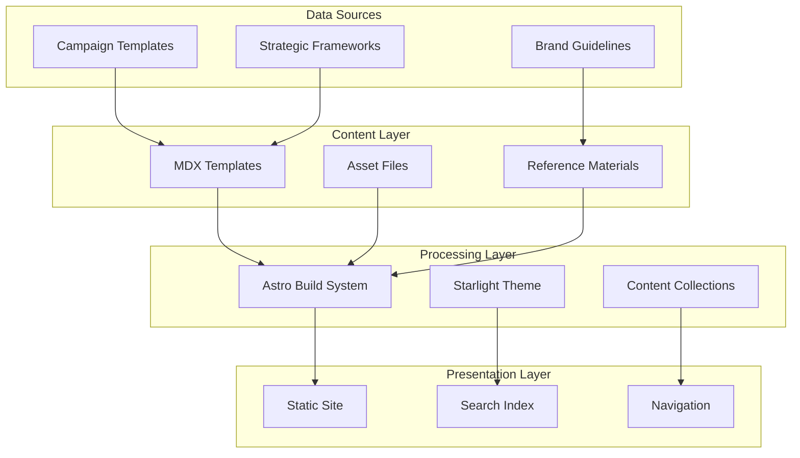
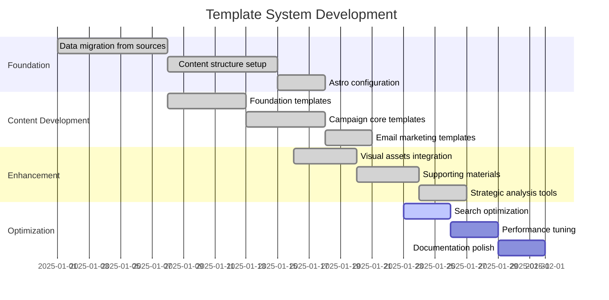

<div align="center">

# HeyZack LaunchBoom Templates


*Comprehensive campaign templates and strategic frameworks for successful product launches*

[🚀 Foundation](./src/content/docs/foundation/) |
[📧 Email Marketing](./src/content/docs/email-marketing/) |
[🎯 Campaign Core](./src/content/docs/campaign-core/) |
[📊 Strategic Analysis](./src/content/docs/strategic-analysis/) |
[🌐 Run Locally](#running-locally)

</div>

## 📚 Documentation System

This repository contains the HeyZack LaunchBoom Templates documentation, a comprehensive collection of campaign templates, strategic frameworks, and marketing assets designed for successful product launches. Built with Astro Starlight for fast, accessible, and beautiful documentation.

### 🗂️ Template Categories

```
src/content/docs/
├── foundation/              # Brand foundation and positioning
│   ├── brand-reference.mdx
│   ├── buyer-persona-template.mdx
│   ├── messaging-direction-summary.mdx
│   └── product-positioning-summary.mdx
├── campaign-core/           # Core campaign strategies and content
│   ├── three-stage-campaign-strategy.mdx
│   ├── campaign-page-copy-customized.mdx
│   ├── video-script-templates.mdx
│   └── implementation-roadmap.mdx
├── email-marketing/         # Email sequences and templates
│   ├── pre-launch-email-sequence.mdx
│   ├── launch-email-sequence.mdx
│   ├── welcome-email-sequence.mdx
│   └── email-template-visual-guidelines.mdx
├── advertising/             # Ad copy and campaign materials
│   ├── pre-launch-ads.mdx
│   ├── live-campaign-ads.mdx
│   └── ad-copy-variations.mdx
├── visual-assets/           # Visual design and production guides
│   ├── campaign-visual-timeline.mdx
│   ├── infographic-templates.mdx
│   ├── video-production-brief.mdx
│   └── packaging-photography-guidelines.mdx
├── supporting-materials/    # Research and planning resources
│   ├── competitor-research.mdx
│   ├── pricing-calculator.mdx
│   ├── press-release.mdx
│   └── social-media-content-calendar.mdx
├── project-management/      # Project tracking and organization
│   ├── todo.md
│   ├── memory.md
│   └── product-list.md
├── strategic-analysis/      # Business analysis frameworks
│   └── index.mdx
├── templates-master/        # Master template index
│   └── index.mdx
└── reference-materials/     # Brand guidelines and context
    ├── brand-guidelines.mdx
    ├── business-context.mdx
    └── AI_Ready_Business_Context.txt
```

### 🌟 Documentation Features

- **📱 Responsive Design**: Optimized for all devices with Starlight's mobile-first approach
- **🔍 Full-Text Search**: Built-in search functionality across all templates
- **🗂️ Category Navigation**: Organized by campaign phase and content type
- **🔄 Cross-References**: Linked templates and related resources
- **🌓 Dark Mode Support**: Automatic theme switching for comfortable reading
- **⚡ Fast Performance**: Static site generation with Astro for lightning-fast loading
- **♿ Accessibility**: WCAG compliant with keyboard navigation and screen reader support

## 🚀 LaunchBoom Campaign Framework

Our template system is built around a proven three-stage campaign methodology:

### 📊 Campaign Performance Metrics

| Stage | Focus Area | Key Templates | Success Metrics |
|-------|------------|---------------|----------------|
| **Stage 1: Foundation** | Brand positioning & audience | Buyer personas, messaging framework | Clear value proposition |
| **Stage 2: Pre-Launch** | Audience building & validation | Email sequences, ad campaigns | Email list growth, engagement |
| **Stage 3: Launch** | Conversion & scaling | Campaign pages, video scripts | Conversion rate, revenue |

### 🎯 Strategic Template Categories

<div align="center">



</div>

```mermaid
graph TD
    A[Foundation Templates] --> A1[Brand Reference]
    A --> A2[Buyer Personas]
    A --> A3[Messaging Framework]
    A --> A4[Product Positioning]
  
    B[Campaign Core] --> B1[Three-Stage Strategy]
    B --> B2[Campaign Page Copy]
    B --> B3[Video Scripts]
    B --> B4[Implementation Roadmap]
  
    C[Email Marketing] --> C1[Pre-Launch Sequence]
    C --> C2[Launch Sequence]
    C --> C3[Welcome Series]
    C --> C4[Visual Guidelines]
  
    D[Supporting Materials] --> D1[Competitor Research]
    D --> D2[Pricing Calculator]
    D --> D3[Press Release]
    D --> D4[Social Media Calendar]
```

## 🔧 Template System Architecture

<div align="center">



</div>

## 💻 Technology Stack

<div align="center">
  <table>
    <tr>
      <th>Framework</th>
      <th>Documentation</th>
      <th>Content</th>
    </tr>
    <tr>
      <td>
        <ul>
          <li>Astro 5.6.1 (Static Site Generator)</li>
          <li>TypeScript for type safety</li>
          <li>Vite for fast development</li>
          <li>Node.js runtime</li>
        </ul>
      </td>
      <td>
        <ul>
          <li>Starlight documentation theme</li>
          <li>Built-in search functionality</li>
          <li>Responsive navigation</li>
          <li>Dark mode support</li>
        </ul>
      </td>
      <td>
        <ul>
          <li>MDX for rich content</li>
          <li>Content Collections API</li>
          <li>Frontmatter validation</li>
          <li>Asset optimization</li>
        </ul>
      </td>
    </tr>
  </table>
</div>

## 📅 Template Development Timeline

<div align="center">



</div>

## 🏆 Template Categories Overview

### 🎯 Foundation Templates
- **Brand Reference**: Complete brand identity and positioning
- **Buyer Personas**: Detailed customer profiles for each campaign stage
- **Messaging Framework**: Core messaging and value propositions
- **Product Positioning**: Market positioning and differentiation

### 🚀 Campaign Core Templates
- **Three-Stage Strategy**: Complete campaign methodology
- **Campaign Page Copy**: High-converting landing page templates
- **Video Scripts**: Engaging video content frameworks
- **Implementation Roadmap**: Step-by-step execution guides

### 📧 Email Marketing Templates
- **Pre-Launch Sequences**: Audience building and validation emails
- **Launch Sequences**: Conversion-focused campaign emails
- **Welcome Series**: New subscriber onboarding
- **Visual Guidelines**: Email design and branding standards

### 🎨 Visual Assets Templates
- **Campaign Timelines**: Visual project planning tools
- **Infographic Templates**: Data visualization frameworks
- **Video Production**: Complete production guidelines
- **Photography Guidelines**: Product and lifestyle photo specs

## 🚀 Running Locally

To run the LaunchBoom templates documentation locally:

1. **Clone the repository**
   ```bash
   git clone <repository-url>
   cd heyzack-launchboom-templates
   ```

2. **Install dependencies**
   ```bash
   npm install
   ```

3. **Start the development server**
   ```bash
   npm run dev
   ```

4. **Open in browser**
   Navigate to [http://localhost:4321](http://localhost:4321)

### 🔧 Available Scripts

```bash
npm run dev      # Start development server
npm run build    # Build for production
npm run preview  # Preview production build
npm run astro    # Run Astro CLI commands
```

## 📖 Core Template Collections

### 🎯 Foundation & Strategy
- [Brand Reference Guide](./src/content/docs/foundation/brand-reference.mdx)
- [Buyer Persona Templates](./src/content/docs/foundation/buyer-persona-template.mdx)
- [Messaging Direction](./src/content/docs/foundation/messaging-direction-summary.mdx)
- [Product Positioning](./src/content/docs/foundation/product-positioning-summary.mdx)

### 🚀 Campaign Execution
- [Three-Stage Campaign Strategy](./src/content/docs/campaign-core/three-stage-campaign-strategy.mdx)
- [Campaign Page Copy](./src/content/docs/campaign-core/campaign-page-copy-customized.mdx)
- [Video Script Templates](./src/content/docs/campaign-core/video-script-templates.mdx)
- [Implementation Roadmap](./src/content/docs/campaign-core/implementation-roadmap.mdx)

### 📧 Email Marketing
- [Pre-Launch Email Sequence](./src/content/docs/email-marketing/pre-launch-email-sequence.mdx)
- [Launch Email Sequence](./src/content/docs/email-marketing/launch-email-sequence.mdx)
- [Welcome Email Sequence](./src/content/docs/email-marketing/welcome-email-sequence.mdx)
- [Email Visual Guidelines](./src/content/docs/email-marketing/email-template-visual-guidelines.mdx)

### 🎯 Advertising & Promotion
- [Pre-Launch Ad Templates](./src/content/docs/advertising/pre-launch-ads.mdx)
- [Live Campaign Ads](./src/content/docs/advertising/live-campaign-ads.mdx)
- [Ad Copy Variations](./src/content/docs/advertising/ad-copy-variations.mdx)

### 🎨 Visual Assets & Production
- [Campaign Visual Timeline](./src/content/docs/visual-assets/campaign-visual-timeline.mdx)
- [Infographic Templates](./src/content/docs/visual-assets/infographic-templates.mdx)
- [Video Production Brief](./src/content/docs/visual-assets/video-production-brief.mdx)
- [Photography Guidelines](./src/content/docs/visual-assets/packaging-photography-guidelines.mdx)

### 📊 Supporting Materials
- [Competitor Research Framework](./src/content/docs/supporting-materials/competitor-research.mdx)
- [Pricing Calculator](./src/content/docs/supporting-materials/pricing-calculator.mdx)
- [Press Release Template](./src/content/docs/supporting-materials/press-release.mdx)
- [Social Media Calendar](./src/content/docs/supporting-materials/social-media-content-calendar.mdx)

## 🔍 Project Management

- [Project Todo List](./src/content/docs/project-management/todo.md)
- [Project Memory](./src/content/docs/project-management/memory.md)
- [Product List](./src/content/docs/project-management/product-list.md)

---

<div align="center">

**Built with ❤️ using Astro Starlight**

*Empowering successful product launches through strategic templates and proven frameworks*

</div>
