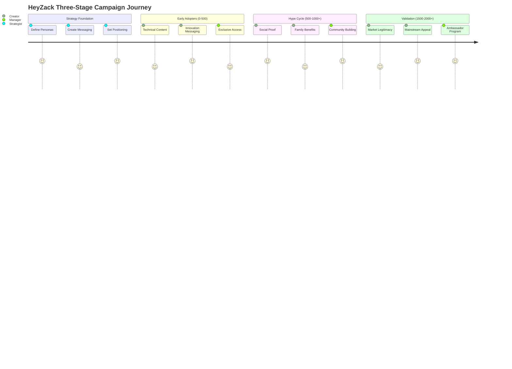
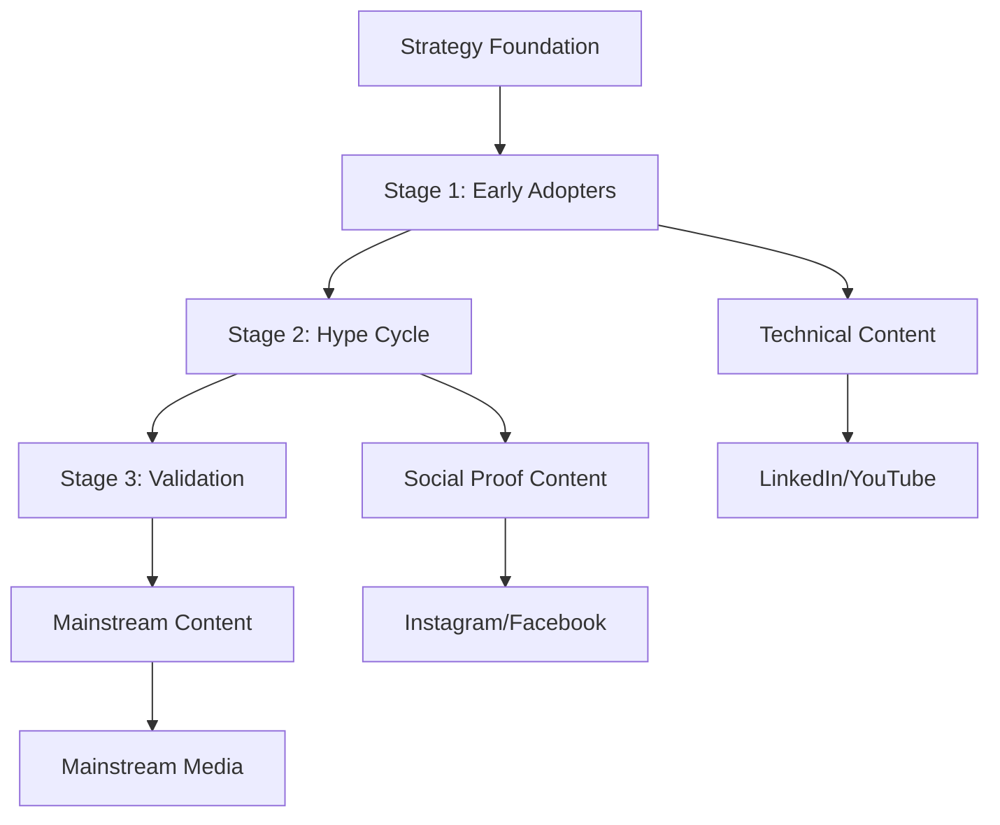

# 🏠 HeyZack LaunchBoom Templates - Wiki Hub
## Your Complete Crowdfunding Campaign System

---

## 🎯 QUICK START NAVIGATION

### 👤 Choose Your Role

| Role | Description | Start Here |
|------|-------------|------------|
| **🎨 Campaign Strategist** | Developing overall campaign approach | [Strategy Foundation](#-strategy-foundation) |
| **✍️ Content Creator** | Writing copy, scripts, and messaging | [Content Templates](#-content-templates) |
| **📊 Campaign Manager** | Executing and optimizing campaigns | [Execution Playbooks](#-execution-playbooks) |
| **🎬 Visual Producer** | Creating assets and visual content | [Visual Systems](#-visual-systems) |
| **📈 Data Analyst** | Tracking and optimizing performance | [Analytics Tracking](#-analytics--tracking) |

---

## 🗺️ CAMPAIGN JOURNEY OVERVIEW

---

## 📚 MAIN SECTIONS

### 🎯 Strategy Foundation
**Start here for campaign planning and positioning**

| Document | Purpose | Stage | Time Required |
|----------|---------|-------|---------------|
| [Buyer Personas](01_Foundation/david-chen.md) | Core audience definition | Foundation | 2-3 hours |
| [Messaging Direction Summary](01_Foundation/HeyZack_MDS_MessagingDirectionSummary.md) | Campaign messaging framework | Foundation | 3-4 hours |
| [Product Positioning](01_Foundation/HeyZack_ProductPositioningSummary.md) | Market positioning strategy | Foundation | 2 hours |
| [Brand Guidelines](01_Foundation/HeyZack_BrandVisualIdentityGuide.md) | Visual identity standards | Foundation | 1 hour |

**🎭 Stage-Specific Personas:**
- [Stage 1: Early Adopters](01_Foundation/stage1-early-adopters-personas.md) (0-500 backers)
- [Stage 2: Hype Cycle](01_Foundation/stage2-hype-cycle-personas.md) (500-1000+ backers)
- [Stage 3: Validation](01_Foundation/stage3-validation-personas.md) (1500-2000+ backers)

### 🌊 Campaign Flows
**Visual diagrams and journey mapping**

| Resource | Description | Use Case |
|----------|-------------|----------|
| [Three-Stage Strategy](02_Campaign_Core/HeyZack_ThreeStage_CampaignStrategy.md) | Complete campaign framework | Strategic planning |
| [Stage-Specific Concepts](02_Campaign_Core/HeyZack_StageSpecific_CampaignConcepts.md) | Tactical campaign ideas | Content planning |
| [Implementation Roadmap](02_Campaign_Core/HeyZack_Implementation_Roadmap.md) | Execution timeline | Project management |

### ✍️ Content Templates
**Ready-to-customize copy and scripts**

#### 📄 Campaign Pages
- [Campaign Page Copy](02_Campaign_Core/HeyZack_CampaignPageCopy_Customized.md) - Main conversion page
- [Landing Page Copy](02_Campaign_Core/HeyZack_LandingPageCopy.md) - Pre-launch capture
- [Visual Hierarchy Guide](02_Campaign_Core/HeyZack_CampaignPageVisualHierarchy.md) - Layout optimization

#### 📧 Email Sequences
- [Welcome Email Sequence](03_Email_Marketing/HeyZack_WelcomeEmailSequence.md) - New subscriber nurturing
- [Pre-Launch Sequence](03_Email_Marketing/HeyZack_PreLaunchEmailSequence.md) - Anticipation building
- [Launch Sequence](03_Email_Marketing/HeyZack_LaunchEmailSequence.md) - Campaign activation

#### 🎬 Video Scripts
- [Campaign Video Script](02_Campaign_Core/HeyZack_CampaignVideoScript_Customized.md) - Main campaign video
- [Stage-Specific Scripts](02_Campaign_Core/HeyZack_VideoScript_Templates.md) - Targeted video content

#### 📱 Advertising Copy
- [Pre-Launch Ads](04_Advertising/HeyZack_PreLaunchAdsCopy.md) - Audience building
- [Live Campaign Ads](04_Advertising/HeyZack_LiveCampaignAdsCopy.md) - Conversion driving
- [Ad Copy Variations](04_Advertising/HeyZack_AdCopyVariations.md) - A/B testing options

### 🎨 Visual Systems
**Asset creation and brand consistency**

| Resource | Purpose | Output |
|----------|---------|--------|
| [Visual Asset Checklist](05_Visual_Assets/HeyZack_VisualAssetChecklist.md) | Asset planning | Production roadmap |
| [Video Production Brief](05_Visual_Assets/HeyZack_VideoProductionBrief.md) | Video creation | Production specs |
| [Photography Guidelines](05_Visual_Assets/HeyZack_PackagingProductPhotographyGuidelines.md) | Product imagery | Photo standards |
| [Infographic Templates](05_Visual_Assets/HeyZack_InfographicTemplates.md) | Data visualization | Infographic designs |

### 🚀 Execution Playbooks
**Implementation and optimization guides**

- **Campaign Management**: Step-by-step execution guides
- **Platform Strategy**: Channel-specific deployment
- **Timeline Planning**: Milestone and deadline management
- **Team Coordination**: Role and responsibility frameworks

### 📊 Analytics & Tracking
**Performance measurement and optimization**

- **KPI Frameworks**: Stage-specific success metrics
- **Conversion Tracking**: Funnel optimization guides
- **ROI Measurement**: Investment return analysis
- **Optimization Playbooks**: Performance improvement strategies

### 📚 Reference Library
**Research, examples, and best practices**

| Resource | Content | Application |
|----------|---------|-------------|
| [Competitor Research](06_Supporting_Materials/HeyZack_CompetitorResearch.md) | Market analysis | Positioning strategy |
| [Press Release](06_Supporting_Materials/HeyZack_PressRelease.md) | Media outreach | PR campaign |
| [Social Media Calendar](06_Supporting_Materials/HeyZack_SocialMediaContentCalendar.md) | Content scheduling | Social strategy |

### 🧠 Strategic Analysis
**High-level strategic planning and market analysis**

| Resource | Content | Application |
|----------|---------|-------------|
| [Business Model Canvas](09_Strategic_Analysis/HeyZack_Business_Model_Canvas.md) | Complete business framework | Strategic planning |
| [Go-to-Market Strategy](09_Strategic_Analysis/HeyZack_Go-to-Market_Strategy_Stage1_Optimization.md) | Market entry strategy | Launch planning |
| [Porter's Five Forces](09_Strategic_Analysis/HeyZack_Porters_Five_Forces_Analysis.md) | Competitive landscape | Market positioning |

### 📁 Reference Materials
**Source documents and brand assets**

| Resource | Content | Application |
|----------|---------|-------------|
| [Brand Guidelines PDF](10_Reference_Materials/HEYZACK_Brand_Guidelines.pdf) | Official brand standards | Design reference |
| [HeyZack Logo](10_Reference_Materials/HeyZack_Logo.svg) | Official logo file | Asset usage |
| [Business Context](10_Reference_Materials/AI_Ready_Business_Context.txt) | AI system context | Technical reference |

### 🛠️ Tools & Calculators
**Practical utilities for campaign planning**

- [Pricing Calculator](06_Supporting_Materials/HeyZack_PricingCalculator.md) - Revenue optimization
- Budget Planning Tools - Cost management
- Timeline Calculators - Schedule optimization
- ROI Estimators - Investment planning

---

## 🎯 QUICK START GUIDES

### 🆕 New Campaign Setup (First Time Users)
1. **Foundation** (Day 1-2)
   - Review [David Chen persona](01_Foundation/david-chen.md)
   - Customize [Messaging Direction Summary](01_Foundation/HeyZack_MDS_MessagingDirectionSummary.md)
   - Adapt [Product Positioning](01_Foundation/HeyZack_ProductPositioningSummary.md)

2. **Strategy** (Day 3-4)
   - Study [Three-Stage Strategy](02_Campaign_Core/HeyZack_ThreeStage_CampaignStrategy.md)
   - Select concepts from [Stage-Specific Ideas](02_Campaign_Core/HeyZack_StageSpecific_CampaignConcepts.md)
   - Plan timeline using [Implementation Roadmap](02_Campaign_Core/HeyZack_Implementation_Roadmap.md)

3. **Content Creation** (Week 2)
   - Customize [Campaign Page Copy](02_Campaign_Core/HeyZack_CampaignPageCopy_Customized.md)
   - Adapt [Email Sequences](03_Email_Marketing/)
   - Modify [Video Scripts](02_Campaign_Core/HeyZack_VideoScript_Templates.md)

### 🔄 Template Customization (Existing Users)
1. **Identify Stage**: Determine current campaign phase
2. **Select Personas**: Choose relevant audience profiles
3. **Customize Content**: Adapt templates to your product
4. **Cross-Reference**: Ensure consistency across materials
5. **Test & Optimize**: Use analytics to refine approach

### ⚡ Emergency Campaign Launch (Rapid Deployment)
1. **Hour 1**: Review [Quick Campaign Concepts](02_Campaign_Core/HeyZack_StageSpecific_CampaignConcepts.md)
2. **Hour 2-4**: Customize [Campaign Page Copy](02_Campaign_Core/HeyZack_CampaignPageCopy_Customized.md)
3. **Hour 5-6**: Adapt [Launch Email Sequence](03_Email_Marketing/HeyZack_LaunchEmailSequence.md)
4. **Hour 7-8**: Deploy using [Implementation Roadmap](02_Campaign_Core/HeyZack_Implementation_Roadmap.md)

---

## 🔍 SEARCH & NAVIGATION

### 📋 By Campaign Stage
- **🌱 Early Adopters (0-500)**: [Stage 1 Personas](01_Foundation/stage1-early-adopters-personas.md) | [Technical Content](02_Campaign_Core/HeyZack_StageSpecific_CampaignConcepts.md#stage-1-early-adopters)
- **🚀 Hype Cycle (500-1000+)**: [Stage 2 Personas](01_Foundation/stage2-hype-cycle-personas.md) | [Social Proof Content](02_Campaign_Core/HeyZack_StageSpecific_CampaignConcepts.md#stage-2-hype-cycle)
- **✅ Validation (1500-2000+)**: [Stage 3 Personas](01_Foundation/stage3-validation-personas.md) | [Mainstream Content](02_Campaign_Core/HeyZack_StageSpecific_CampaignConcepts.md#stage-3-validation)

### 📋 By Content Type
- **📝 Copy & Messaging**: [Campaign Pages](02_Campaign_Core/) | [Email Marketing](03_Email_Marketing/) | [Advertising](04_Advertising/)
- **🎬 Video & Visual**: [Video Scripts](02_Campaign_Core/HeyZack_VideoScript_Templates.md) | [Visual Assets](05_Visual_Assets/)
- **📊 Strategy & Planning**: [Foundation](01_Foundation/) | [Implementation](02_Campaign_Core/HeyZack_Implementation_Roadmap.md)
- **🔧 Tools & Utilities**: [Calculators](06_Supporting_Materials/) | [Checklists](05_Visual_Assets/HeyZack_VisualAssetChecklist.md)

### 📋 By User Role
- **👨‍💼 Campaign Manager**: [Implementation Roadmap](02_Campaign_Core/HeyZack_Implementation_Roadmap.md) | [Social Media Calendar](06_Supporting_Materials/HeyZack_SocialMediaContentCalendar.md)
- **✍️ Content Writer**: [All Copy Templates](02_Campaign_Core/) | [Email Sequences](03_Email_Marketing/) | [Ad Copy](04_Advertising/)
- **🎨 Creative Director**: [Visual Guidelines](01_Foundation/HeyZack_BrandVisualIdentityGuide.md) | [Visual Assets](05_Visual_Assets/)
- **📊 Data Analyst**: [Pricing Calculator](06_Supporting_Materials/HeyZack_PricingCalculator.md) | [Competitor Research](06_Supporting_Materials/HeyZack_CompetitorResearch.md)

---

## 🏷️ TAG SYSTEM

**#foundation** - Core strategy and positioning documents  
**#personas** - Audience definition and targeting  
**#messaging** - Copy, scripts, and communication  
**#visual** - Design, assets, and brand elements  
**#execution** - Implementation and deployment  
**#optimization** - Testing, analytics, and improvement  
**#stage1** - Early adopter focused content  
**#stage2** - Hype cycle focused content  
**#stage3** - Validation focused content  
**#email** - Email marketing materials  
**#ads** - Advertising and paid content  
**#video** - Video scripts and production  
**#tools** - Calculators and utilities  

---

## 📞 SUPPORT & RESOURCES

### 🆘 Getting Help
- **Template Questions**: Check related documents in same folder
- **Strategy Guidance**: Start with [Three-Stage Strategy](02_Campaign_Core/HeyZack_ThreeStage_CampaignStrategy.md)
- **Implementation Issues**: Refer to [Implementation Roadmap](02_Campaign_Core/HeyZack_Implementation_Roadmap.md)
- **Content Customization**: Use persona documents as reference

### 🔄 Updates & Maintenance
- **Version Control**: Track changes in [Project Management](07_Project_Management/)
- **Template Updates**: Monitor for new versions and improvements
- **Performance Feedback**: Use analytics to inform template refinements

### 🎓 Learning Resources
- **Best Practices**: Review [Competitor Research](06_Supporting_Materials/HeyZack_CompetitorResearch.md)
- **Case Studies**: Analyze HeyZack examples throughout templates
- **Industry Insights**: Stay updated with crowdfunding trends and strategies

---

**🎯 Ready to launch your campaign? Start with your role above or jump directly to the [Three-Stage Strategy](02_Campaign_Core/HeyZack_ThreeStage_CampaignStrategy.md)!**

---

*This wiki system transforms the HeyZack LaunchBoom templates into an integrated, navigable campaign development platform. Use the navigation above to find exactly what you need, when you need it.*