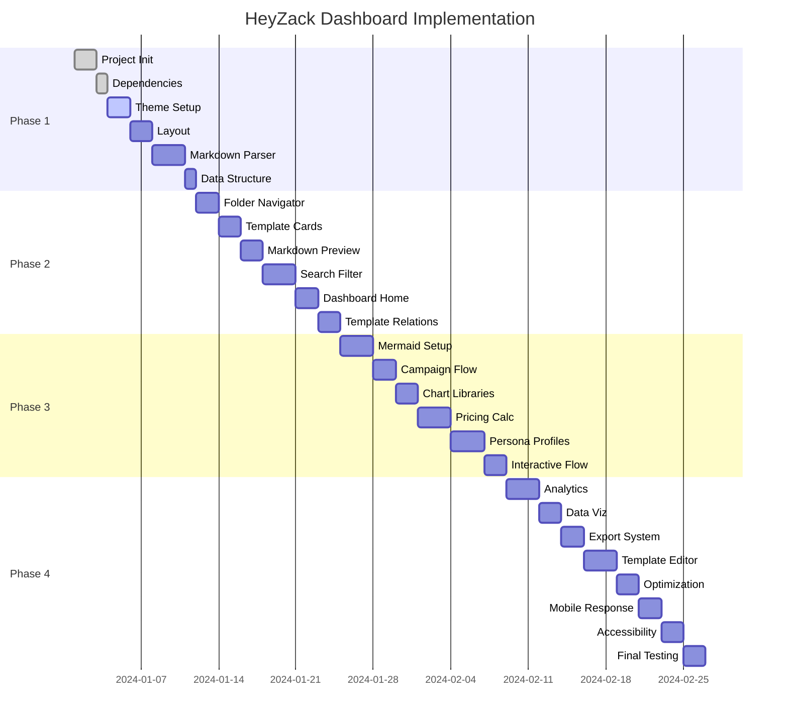

# HeyZack React Dashboard - Implementation Tasks

## Project Timeline: 4 Weeks

### Phase 1: Foundation Setup (Week 1)
**Goal**: Establish project foundation with Next.js, NextUI, and ReactBits.dev

#### Day 1-2: Project Initialization
- [ ] **Task 1.1**: Initialize Next.js 14 project with TypeScript
  - Create new Next.js app with App Router
  - Configure TypeScript and ESLint
  - Set up Tailwind CSS
  - **Deliverable**: Basic Next.js project structure
  - **Time**: 4 hours

- [ ] **Task 1.2**: Install and configure dependencies
  - Install NextUI v2 with theme provider
  - Install ReactBits.dev components
  - Install markdown processing libraries (react-markdown, gray-matter)
  - Install state management (Zustand)
  - **Deliverable**: Package.json with all dependencies
  - **Time**: 2 hours

#### Day 3-4: Core Setup
- [ ] **Task 1.3**: Configure NextUI theme and providers
  - Set up NextUIProvider in layout
  - Configure custom theme colors for HeyZack brand
  - Set up dark/light mode toggle
  - **Deliverable**: Themed application shell
  - **Time**: 6 hours

- [ ] **Task 1.4**: Create base layout and navigation
  - Build responsive sidebar navigation
  - Create header with search and user menu
  - Implement breadcrumb navigation
  - **Deliverable**: Complete layout structure
  - **Time**: 8 hours

#### Day 5-7: Data Processing Pipeline
- [ ] **Task 1.5**: Implement markdown parsing system
  - Create markdown file reader
  - Set up frontmatter extraction
  - Build content indexing system
  - **Deliverable**: Markdown processing utilities
  - **Time**: 10 hours

- [ ] **Task 1.6**: Create data structure and types
  - Define TypeScript interfaces for templates
  - Create data models for campaigns and personas
  - Set up Zustand store structure
  - **Deliverable**: Type definitions and store setup
  - **Time**: 4 hours

### Phase 2: Core Components (Week 2)
**Goal**: Build essential dashboard components and template navigation

#### Day 8-9: Template Navigation
- [ ] **Task 2.1**: Build folder structure navigator
  - Create tree view for 10-folder structure
  - Implement folder expansion/collapse
  - Add file count indicators
  - **Deliverable**: Interactive folder tree
  - **Time**: 8 hours

- [ ] **Task 2.2**: Create template card components
  - Design template preview cards
  - Add metadata display (stage, persona, type)
  - Implement hover effects and animations
  - **Deliverable**: Template card library
  - **Time**: 6 hours

#### Day 10-11: Content Preview
- [ ] **Task 2.3**: Build markdown preview component
  - Create syntax-highlighted markdown renderer
  - Add copy-to-clipboard functionality
  - Implement responsive preview layout
  - **Deliverable**: Markdown preview system
  - **Time**: 8 hours

- [ ] **Task 2.4**: Implement search and filter system
  - Create search input with autocomplete
  - Build filter sidebar with categories
  - Add tag-based filtering
  - **Deliverable**: Search and filter interface
  - **Time**: 10 hours

#### Day 12-14: Dashboard Home
- [ ] **Task 2.5**: Create dashboard overview page
  - Build campaign progress overview
  - Add quick action buttons
  - Create recent activity feed
  - **Deliverable**: Dashboard home page
  - **Time**: 8 hours

- [ ] **Task 2.6**: Implement template relationship mapping
  - Show template dependencies
  - Create visual connection indicators
  - Add related template suggestions
  - **Deliverable**: Template relationship system
  - **Time**: 6 hours

### Phase 3: Interactive Features (Week 3)
**Goal**: Add advanced interactivity with charts and diagrams

#### Day 15-16: Mermaid Integration
- [ ] **Task 3.1**: Integrate Mermaid.js for diagrams
  - Set up Mermaid rendering component
  - Parse mermaid blocks from markdown
  - Add interactive diagram features
  - **Deliverable**: Interactive Mermaid diagrams
  - **Time**: 10 hours

- [ ] **Task 3.2**: Build campaign flow visualization
  - Create campaign stage progression
  - Add clickable stage navigation
  - Implement progress tracking
  - **Deliverable**: Campaign flow interface
  - **Time**: 8 hours

#### Day 17-18: Chart Libraries Setup
- [ ] **Task 3.3**: Install and configure chart libraries
  - Set up Recharts for primary charts
  - Configure Chart.js for advanced visualizations
  - Install Tremor for dashboard charts
  - **Deliverable**: Chart library configuration
  - **Time**: 6 hours

- [ ] **Task 3.4**: Create pricing calculator component
  - Build interactive pricing form
  - Add ROI calculation logic
  - Create comparison charts
  - **Deliverable**: Pricing calculator with charts
  - **Time**: 12 hours

#### Day 19-21: Persona Journey Mapping
- [ ] **Task 3.5**: Build persona profile components
  - Create persona card displays
  - Add journey stage mapping
  - Implement touchpoint visualization
  - **Deliverable**: Persona journey interface
  - **Time**: 10 hours

- [ ] **Task 3.6**: Implement interactive persona flows
  - Create clickable journey maps
  - Add stage-specific content filtering
  - Build persona-template relationships
  - **Deliverable**: Interactive persona system
  - **Time**: 8 hours

### Phase 4: Advanced Features (Week 4)
**Goal**: Complete analytics, export functionality, and optimizations

#### Day 22-23: Analytics Dashboard
- [ ] **Task 4.1**: Build analytics overview page
  - Create campaign metrics dashboard
  - Add performance tracking charts
  - Implement goal progress visualization
  - **Deliverable**: Analytics dashboard
  - **Time**: 10 hours

- [ ] **Task 4.2**: Implement data visualization components
  - Create trend analysis charts
  - Add comparison visualizations
  - Build metric summary cards
  - **Deliverable**: Data visualization library
  - **Time**: 8 hours

#### Day 24-25: Export and Editing
- [ ] **Task 4.3**: Add export functionality
  - Implement PDF export for templates
  - Add markdown download options
  - Create bulk export features
  - **Deliverable**: Export system
  - **Time**: 8 hours

- [ ] **Task 4.4**: Build template editing interface
  - Create markdown editor with preview
  - Add frontmatter editing
  - Implement save/version tracking
  - **Deliverable**: Template editor
  - **Time**: 10 hours

#### Day 26-28: Optimization and Polish
- [ ] **Task 4.5**: Performance optimization
  - Implement code splitting
  - Add lazy loading for components
  - Optimize bundle size
  - **Deliverable**: Optimized application
  - **Time**: 8 hours

- [ ] **Task 4.6**: Mobile responsiveness
  - Optimize for mobile devices
  - Test across different screen sizes
  - Implement touch-friendly interactions
  - **Deliverable**: Mobile-optimized dashboard
  - **Time**: 6 hours

- [ ] **Task 4.7**: Accessibility improvements
  - Add ARIA labels and descriptions
  - Implement keyboard navigation
  - Test with screen readers
  - **Deliverable**: Accessible dashboard
  - **Time**: 6 hours

- [ ] **Task 4.8**: Final testing and deployment
  - Comprehensive testing across features
  - Bug fixes and refinements
  - Deployment preparation
  - **Deliverable**: Production-ready dashboard
  - **Time**: 8 hours

## Dependencies and Prerequisites

### Technical Dependencies
- Node.js 18+ installed
- Git for version control
- VS Code or preferred IDE
- Access to HeyZack brand assets

### Task Dependencies

## Resource Requirements

### Development Team
- **Frontend Developer**: React/Next.js expertise
- **UI/UX Designer**: NextUI and ReactBits.dev experience
- **Data Analyst**: Chart library and visualization knowledge

### Tools and Software
- **Development**: VS Code, Node.js, Git
- **Design**: Figma for mockups
- **Testing**: Jest, React Testing Library
- **Deployment**: Vercel or Netlify

## Success Metrics

### Technical Metrics
- [ ] **Performance**: Page load time < 3 seconds
- [ ] **Responsiveness**: Works on mobile, tablet, desktop
- [ ] **Accessibility**: WCAG 2.1 AA compliance
- [ ] **Browser Support**: Chrome, Firefox, Safari, Edge

### Functional Metrics
- [ ] **Template Navigation**: Browse all 10 categories
- [ ] **Search**: Find templates in < 500ms
- [ ] **Preview**: View markdown with formatting
- [ ] **Charts**: Interactive pricing calculator
- [ ] **Export**: Download templates in multiple formats

### User Experience Metrics
- [ ] **Intuitive Navigation**: Users can find templates without training
- [ ] **Visual Appeal**: Modern, professional interface
- [ ] **Interactive Elements**: Smooth animations and transitions
- [ ] **Mobile Experience**: Fully functional on mobile devices

## Risk Mitigation

### Technical Risks
- **Risk**: Large markdown files causing performance issues
  - **Mitigation**: Implement virtual scrolling and lazy loading
- **Risk**: Mermaid diagrams not rendering properly
  - **Mitigation**: Fallback to static images with alt text
- **Risk**: Chart libraries conflicting
  - **Mitigation**: Use dynamic imports and separate bundles

### Timeline Risks
- **Risk**: Complex features taking longer than estimated
  - **Mitigation**: Prioritize MVP features, defer advanced features
- **Risk**: Integration issues with existing data structure
  - **Mitigation**: Early testing with sample data

## Quality Assurance

### Testing Strategy
- **Unit Tests**: Component-level testing with Jest
- **Integration Tests**: Feature workflow testing
- **E2E Tests**: Full user journey testing
- **Performance Tests**: Load time and responsiveness
- **Accessibility Tests**: Screen reader and keyboard navigation

### Code Quality
- **ESLint**: Code style and error checking
- **Prettier**: Code formatting
- **TypeScript**: Type safety
- **Husky**: Pre-commit hooks

## Deployment Strategy

### Development Environment
- Local development with hot reload
- Git feature branches for each task
- Pull request reviews

### Staging Environment
- Vercel preview deployments
- Testing with production data
- Performance monitoring

### Production Environment
- Static site deployment
- CDN for optimal performance
- Analytics and error tracking

## Post-Launch Maintenance

### Immediate (Week 5)
- [ ] Bug fixes from user feedback
- [ ] Performance optimizations
- [ ] Additional chart types

### Short-term (Month 2-3)
- [ ] Advanced search features
- [ ] Template versioning
- [ ] Collaboration tools

### Long-term (Month 4+)
- [ ] AI-powered template suggestions
- [ ] Advanced analytics
- [ ] Integration with external tools

This task breakdown provides a comprehensive roadmap for implementing the HeyZack React dashboard with clear deliverables, timelines, and success criteria.