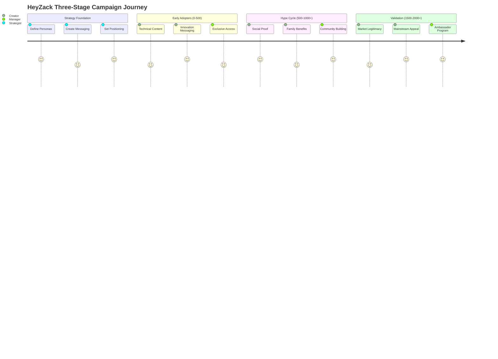
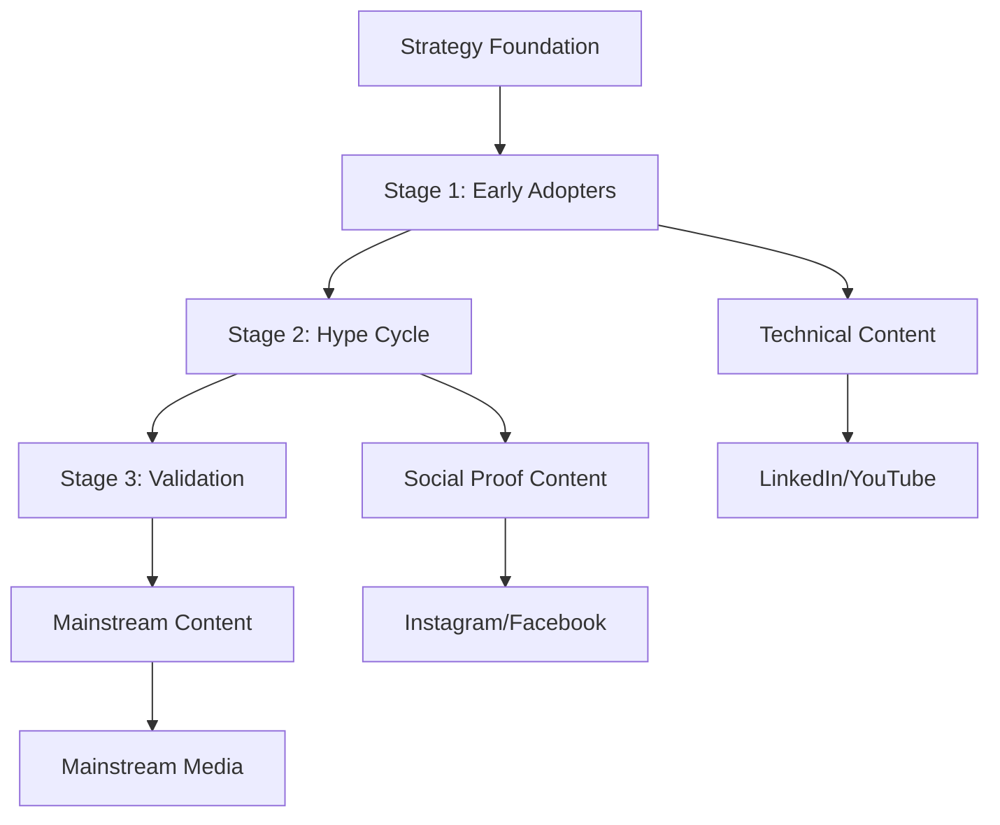

# 🏠 HeyZack LaunchBoom Templates - Wiki Hub
## Your Complete Crowdfunding Campaign System

---

## 🎯 QUICK START NAVIGATION

### 👤 Choose Your Role

| Role | Description | Start Here |
|------|-------------|------------|
| **🎨 Campaign Strategist** | Developing overall campaign approach | [Strategy Foundation](#-strategy-foundation) |
| **✍️ Content Creator** | Writing copy, scripts, and messaging | [Content Templates](#-content-templates) |
| **📊 Campaign Manager** | Executing and optimizing campaigns | [Execution Playbooks](#-execution-playbooks) |
| **🎬 Visual Producer** | Creating assets and visual content | [Visual Systems](#-visual-systems) |
| **📈 Data Analyst** | Tracking and optimizing performance | [Analytics Tracking](#-analytics--tracking) |

---

## 🗺️ CAMPAIGN JOURNEY OVERVIEW

---

## 📚 MAIN SECTIONS

### 🎯 Strategy Foundation
**Start here for campaign planning and positioning**

| Document | Purpose | Stage | Time Required |
|----------|---------|-------|---------------|
| [Buyer Personas](foundation/david-chen/) | Core audience definition | Foundation | 2-3 hours |
| [Messaging Direction Summary](foundation/messaging-direction-summary/) | Campaign messaging framework | Foundation | 3-4 hours |
| [Product Positioning](foundation/product-positioning-summary/) | Market positioning strategy | Foundation | 2 hours |
| [Brand Guidelines](foundation/brand-visual-identity-guide/) | Visual identity standards | Foundation | 1 hour |

**🎭 Stage-Specific Personas:**
- [Stage 1: Early Adopters](foundation/stage1-early-adopters-personas/) (0-500 backers)
- [Stage 2: Hype Cycle](foundation/stage2-hype-cycle-personas/) (500-1000+ backers)
- [Stage 3: Validation](foundation/stage3-validation-personas/) (1500-2000+ backers)

### 🌊 Campaign Flows
**Visual diagrams and journey mapping**

| Resource | Description | Use Case |
|----------|-------------|----------|
| [Three-Stage Strategy](campaign-core/three-stage-campaign-strategy/) | Complete campaign framework | Strategic planning |
| [Stage-Specific Concepts](campaign-core/stage-specific-campaign-concepts/) | Tactical campaign ideas | Content planning |
| [Implementation Roadmap](campaign-core/implementation-roadmap/) | Execution timeline | Project management |

### ✍️ Content Templates
**Ready-to-customize copy and scripts**

#### 📄 Campaign Pages
- [Campaign Page Copy](campaign-core/campaign-page-copy-customized/) - Main conversion page
- [Landing Page Copy](campaign-core/landing-page-copy/) - Pre-launch capture
- [Visual Hierarchy Guide](campaign-core/campaign-page-visual-hierarchy/) - Layout optimization

#### 📧 Email Sequences
- [Welcome Email Sequence](email-marketing/welcome-email-sequence/) - New subscriber nurturing
- [Pre-Launch Sequence](email-marketing/pre-launch-email-sequence/) - Anticipation building
- [Launch Sequence](email-marketing/launch-email-sequence/) - Campaign activation

#### 🎬 Video Scripts
- [Campaign Video Script](campaign-core/campaign-video-script-customized/) - Main campaign video
- [Stage-Specific Scripts](campaign-core/video-script-templates/) - Targeted video content

#### 📱 Advertising Copy
- [Pre-Launch Ads](advertising/pre-launch-ads-copy/) - Audience building
- [Live Campaign Ads](advertising/live-campaign-ads-copy/) - Conversion driving
- [Ad Copy Variations](advertising/ad-copy-variations/) - A/B testing options

### 🎨 Visual Systems
**Asset creation and brand consistency**

| Resource | Purpose | Output |
|----------|---------|--------|
| [Visual Asset Checklist](visual-assets/visual-asset-checklist/) | Asset planning | Production roadmap |
| [Video Production Brief](visual-assets/video-production-brief/) | Video creation | Production specs |
| [Photography Guidelines](visual-assets/packaging-product-photography-guidelines/) | Product imagery | Photo standards |
| [Infographic Templates](visual-assets/infographic-templates/) | Data visualization | Infographic designs |

### 🚀 Execution Playbooks
**Implementation and optimization guides**

| Resource | Description | Use Case |
|----------|-------------|----------|
| [Campaign Launch Playbook](supporting-materials/campaign-launch-playbook/) | Launch execution | Step-by-step guide |
| [Project Management Templates](project-management/project-management-templates/) | Team coordination | Workflow tools |
| [Performance Tracking](strategic-analysis/performance-tracking-template/) | Campaign monitoring | Analytics framework |
| [Master Template Collection](templates-master/template-collection/) | All templates | Complete toolkit |

### 📊 Analytics & Tracking
**Performance measurement and optimization**

| Resource | Description | Use Case |
|----------|-------------|----------|
| [Performance Metrics](strategic-analysis/performance-metrics-framework/) | KPI tracking | Success measurement |
| [Campaign Analytics](strategic-analysis/campaign-analytics-template/) | Data analysis | Performance insights |
| [ROI Calculator](strategic-analysis/roi-calculator/) | Financial tracking | Investment returns |
| [A/B Testing Framework](strategic-analysis/ab-testing-framework/) | Optimization testing | Performance improvement |
| [Timeline Planner](project-management/timeline-planner/) | Project scheduling | Milestone tracking |
| [Budget Template](project-management/budget-template/) | Cost management | Financial control |
| [Checklist Generator](templates-master/checklist-generator/) | Task management | Quality assurance |

### 📚 Reference Library
**Research, examples, and best practices**

| Resource | Content | Application |
|----------|---------|-------------|
| [Competitor Research](supporting-materials/competitor-research/) | Market analysis | Positioning strategy |
| [Press Release](supporting-materials/press-release/) | Media outreach | PR campaign |
| [Social Media Calendar](supporting-materials/social-media-content-calendar/) | Content scheduling | Social strategy |

### 🧠 Strategic Analysis
**High-level strategic planning and market analysis**

| Resource | Content | Application |
|----------|---------|-------------|
| [Business Model Canvas](strategic-analysis/business-model-canvas/) | Complete business framework | Strategic planning |
| [Go-to-Market Strategy](strategic-analysis/go-to-market-strategy-stage1-optimization/) | Market entry strategy | Launch planning |
| [Porter's Five Forces](strategic-analysis/porters-five-forces-analysis/) | Competitive landscape | Market positioning |

### 📁 Reference Materials
**Source documents and brand assets**

| Resource | Content | Application |
|----------|---------|-------------|
| [Brand Guidelines PDF](reference-materials/brand-guidelines/) | Official brand standards | Design reference |
| [HeyZack Logo](reference-materials/logo/) | Official logo file | Asset usage |
| [Business Context](reference-materials/ai-ready-business-context/) | AI system context | Technical reference |

### 🛠️ Tools & Calculators
**Practical utilities for campaign planning**

- [Pricing Calculator](supporting-materials/pricing-calculator/) - Revenue optimization
- Budget Planning Tools - Cost management
- Timeline Calculators - Schedule optimization
- ROI Estimators - Investment planning

---

## 🎯 QUICK START GUIDES

### 🆕 New Campaign Setup (First Time Users)
1. **Foundation** (Day 1-2)
   - Review [David Chen persona](foundation/david-chen/)
- Customize [Messaging Direction Summary](foundation/messaging-direction-summary/)
- Adapt [Product Positioning](foundation/product-positioning-summary/)

2. **Strategy** (Day 3-4)
   - Study [Three-Stage Strategy](campaign-core/three-stage-campaign-strategy/)
- Select concepts from [Stage-Specific Ideas](campaign-core/stage-specific-campaign-concepts/)
- Plan timeline using [Implementation Roadmap](campaign-core/implementation-roadmap/)

3. **Content Creation** (Week 2)
   - Customize [Campaign Page Copy](campaign-core/campaign-page-copy-customized/)
- Adapt [Email Sequences](email-marketing/)
- Modify [Video Scripts](campaign-core/video-script-templates/)

### 🔄 Template Customization (Existing Users)
1. **Identify Stage**: Determine current campaign phase
2. **Select Personas**: Choose relevant audience profiles
3. **Customize Content**: Adapt templates to your product
4. **Cross-Reference**: Ensure consistency across materials
5. **Test & Optimize**: Use analytics to refine approach

### ⚡ Emergency Campaign Launch (Rapid Deployment)
1. **Hour 1**: Review [Quick Campaign Concepts](campaign-core/stage-specific-campaign-concepts/)
2. **Hour 2-4**: Customize [Campaign Page Copy](campaign-core/campaign-page-copy-customized/)
3. **Hour 5-6**: Adapt [Launch Email Sequence](email-marketing/launch-email-sequence/)
4. **Hour 7-8**: Deploy using [Implementation Roadmap](campaign-core/implementation-roadmap/)

---

## 🔍 SEARCH & NAVIGATION

### 📋 By Campaign Stage
- **🌱 Early Adopters (0-500)**: [Stage 1 Personas](foundation/stage1-early-adopters-personas/) | [Technical Content](campaign-core/stage-specific-campaign-concepts/#stage-1-early-adopters)
- **🚀 Hype Cycle (500-1000+)**: [Stage 2 Personas](foundation/stage2-hype-cycle-personas/) | [Social Proof Content](campaign-core/stage-specific-campaign-concepts/#stage-2-hype-cycle)
- **✅ Validation (1500-2000+)**: [Stage 3 Personas](foundation/stage3-validation-personas/) | [Mainstream Content](campaign-core/stage-specific-campaign-concepts/#stage-3-validation)

### 📋 By Content Type
- **📝 Copy & Messaging**: [Campaign Pages](campaign-core/) | [Email Marketing](email-marketing/) | [Advertising](advertising/)
- **🎬 Video & Visual**: [Video Scripts](campaign-core/video-script-templates/) | [Visual Assets](visual-assets/)
- **📊 Strategy & Planning**: [Foundation](foundation/) | [Implementation](campaign-core/implementation-roadmap/)
- **🔧 Tools & Utilities**: [Calculators](supporting-materials/) | [Checklists](visual-assets/visual-asset-checklist/)

### 📋 By User Role
- **👨‍💼 Campaign Manager**: [Implementation Roadmap](campaign-core/implementation-roadmap/) | [Social Media Calendar](supporting-materials/social-media-content-calendar/)
- **✍️ Content Writer**: [All Copy Templates](campaign-core/) | [Email Sequences](email-marketing/) | [Ad Copy](advertising/)
- **🎨 Creative Director**: [Visual Guidelines](foundation/brand-visual-identity-guide/) | [Visual Assets](visual-assets/)
- **📊 Data Analyst**: [Pricing Calculator](supporting-materials/pricing-calculator/) | [Competitor Research](supporting-materials/competitor-research/)

---

## 🏷️ TAG SYSTEM

**#foundation** - Core strategy and positioning documents  
**#personas** - Audience definition and targeting  
**#messaging** - Copy, scripts, and communication  
**#visual** - Design, assets, and brand elements  
**#execution** - Implementation and deployment  
**#optimization** - Testing, analytics, and improvement  
**#stage1** - Early adopter focused content  
**#stage2** - Hype cycle focused content  
**#stage3** - Validation focused content  
**#email** - Email marketing materials  
**#ads** - Advertising and paid content  
**#video** - Video scripts and production  
**#tools** - Calculators and utilities  

---

## 📞 SUPPORT & RESOURCES

### 🆘 Getting Help
- **Template Questions**: Check related documents in same folder
- **Strategy Guidance**: Start with [Three-Stage Strategy](campaign-core/three-stage-campaign-strategy/)
- **Implementation Issues**: Refer to [Implementation Roadmap](campaign-core/implementation-roadmap/)
- **Content Customization**: Use persona documents as reference

### 🔄 Updates & Maintenance
- **Version Control**: Track changes in [Project Management](project-management/)
- **Template Updates**: Monitor for new versions and improvements
- **Performance Feedback**: Use analytics to inform template refinements

### 🎓 Learning Resources
- **Best Practices**: Review [Competitor Research](supporting-materials/competitor-research/)
- **Case Studies**: Analyze HeyZack examples throughout templates
- **Industry Insights**: Stay updated with crowdfunding trends and strategies

---

**🎯 Ready to launch your campaign? Start with your role above or jump directly to the [Three-Stage Strategy](campaign-core/three-stage-campaign-strategy/)!**

---

*This wiki system transforms the HeyZack LaunchBoom templates into an integrated, navigable campaign development platform. Use the navigation above to find exactly what you need, when you need it.*