import { Card, CardGrid, Badge, LinkCard, Aside, Icon } from '@astrojs/starlight/components';

## Your Complete Crowdfunding Campaign System

---

## 🎯 QUICK START NAVIGATION

### 👤 Choose Your Role

<CardGrid cols={2}>
  <Card title="🎨 Campaign Strategist" icon="star">
    Developing overall campaign approach and positioning
    
    **Start Here:** [Strategy Foundation](/foundation/)
    
    <Badge text="Foundation" variant="tip" />
  </Card>
  
  <Card title="✍️ Content Creator" icon="pencil">
    Writing copy, scripts, and messaging for all campaign stages
    
    **Start Here:** [Content Templates](/campaign-core/)
    
    <Badge text="Templates" variant="note" />
  </Card>
  
  <Card title="📊 Campaign Manager" icon="rocket">
    Executing and optimizing live campaigns
    
    **Start Here:** [Execution Playbooks](/supporting-materials/campaign-launch-playbook/)
    
    <Badge text="Management" variant="caution" />
  </Card>
  
  <Card title="🎬 Visual Producer" icon="image">
    Creating assets and visual content for campaigns
    
    **Start Here:** [Visual Systems](/visual-assets/)
    
    <Badge text="Creative" variant="success" />
  </Card>
  
  <Card title="📈 Data Analyst" icon="information">
    Tracking and optimizing campaign performance
    
    **Start Here:** [Analytics & Tracking](/strategic-analysis/performance-tracking-template/)
    
    <Badge text="Analytics" variant="danger" />
  </Card>
  
  <Card title="🚀 All-in-One" icon="open-book">
    Complete campaign system for solo entrepreneurs
    
    **Start Here:** [All Resources](/templates-master/template-collection/)
    
    <Badge text="Complete" variant="default" />
  </Card>
</CardGrid>

---

## 🗺️ CAMPAIGN JOURNEY OVERVIEW

---

## 📚 MAIN SECTIONS

### 🎯 Strategy Foundation
**Start here for campaign planning and positioning**

<Aside type="tip" title="Campaign Success Starts Here">
  These foundational documents establish your campaign's strategic direction and target audience understanding.
</Aside>

<CardGrid cols={2}>
  <LinkCard
    title="Brand Visual Identity Guide"
    description="Complete brand system and visual standards for consistent campaign presentation"
    href="/foundation/brand-visual-identity-guide"
  />
  
  <LinkCard
    title="Product Positioning Summary"
    description="Core value proposition and market positioning strategy"
    href="/foundation/product-positioning-summary"
  />
  
  <LinkCard
    title="Messaging Direction Summary"
    description="Key messages and communication strategy across all touchpoints"
    href="/foundation/messaging-direction-summary"
  />
  
  <LinkCard
    title="Buyer Persona Template"
    description="Target audience definition and behavioral insights"
    href="/foundation/buyer-persona-template"
  />
</CardGrid>

#### Campaign Stage Personas

<CardGrid cols={3}>
  <Card title="Stage 1: Early Adopters" icon="rocket">
    **Timeline:** First 48 hours
    
    Focus on innovation enthusiasts and early supporters
    
    <Badge text="Launch" variant="success" />
    
    [View Persona →](foundation/stage1-early-adopters-personas/)
  </Card>
  
  <Card title="Stage 2: Hype Cycle" icon="heart">
    **Timeline:** Days 3-21
    
    Mainstream audience activation and social proof building
    
    <Badge text="Growth" variant="caution" />
    
    [View Persona →](foundation/stage2-hype-cycle-personas/)
  </Card>
  
  <Card title="Stage 3: Validation" icon="star">
    **Timeline:** Final push
    
    Last-chance buyers and goal achievement focus
    
    <Badge text="Close" variant="danger" />
    
    [View Persona →](foundation/stage3-validation-personas/)
  </Card>
</CardGrid>

### 🌊 Campaign Flows
**Visual diagrams and journey mapping**

<Aside type="note" title="Campaign Journey Overview">
  Follow this proven 3-stage framework to maximize your crowdfunding success from early adopters through mainstream validation.

```mermaid
graph TD
    A[🎯 Strategy Foundation] --> B[🚀 Stage 1: Early Adopters]
    B --> C[📈 Stage 2: Hype Cycle]
    C --> D[🏁 Stage 3: Validation]
    
    B --> E[⚡ Technical Content]
    C --> F[⭐ Social Proof Content]
    D --> G[📱 Mainstream Content]
    
    E --> H[💼 LinkedIn/YouTube]
    F --> I[📸 Instagram/Facebook]
    G --> J[📺 Mainstream Media]
    
    style A fill:#e1f5fe
    style B fill:#f3e5f5
    style C fill:#e8f5e8
    style D fill:#fff3e0
```

</Aside>

#### Campaign Resources by Stage

<CardGrid cols={3}>
  <LinkCard
    title="Three-Stage Strategy"
    description="Complete campaign framework with strategic planning guidelines for all phases"
    href="/campaign-core/three-stage-campaign-strategy"
  />
  
  <LinkCard
    title="Stage-Specific Concepts"
    description="Tactical campaign ideas and content planning strategies for each stage"
    href="/campaign-core/stage-specific-campaign-concepts"
  />
  
  <LinkCard
    title="Implementation Roadmap"
    description="Execution timeline and project management framework for campaign deployment"
    href="/campaign-core/implementation-roadmap"
  />
</CardGrid>

### ✍️ Content Templates
**Ready-to-customize copy and scripts**

<Aside type="caution" title="Content Strategy">
  All templates are optimized for the three-stage campaign approach. Customize messaging for your specific audience and product.
</Aside>

import { Tabs, TabItem } from '@astrojs/starlight/components';

<Tabs>
  <TabItem label="📄 Campaign Pages">
    <CardGrid cols={1}>
      <LinkCard
        title="Campaign Page Copy"
        description="Main conversion page with proven messaging hierarchy and conversion optimization"
        href="/campaign-core/campaign-page-copy-customized"
      />
      
      <LinkCard
        title="Landing Page Copy"
        description="Pre-launch capture page to build audience and generate early interest"
        href="/campaign-core/landing-page-copy"
      />
      
      <LinkCard
        title="Visual Hierarchy Guide"
        description="Layout optimization framework for maximum conversion and user experience"
        href="/campaign-core/campaign-page-visual-hierarchy"
      />
    </CardGrid>
  </TabItem>
  
  <TabItem label="📧 Email Sequences">
    <CardGrid cols={1}>
      <LinkCard
        title="Welcome Email Sequence"
        description="New subscriber nurturing series to build relationship and campaign awareness"
        href="/email-marketing/welcome-email-sequence"
      />
      
      <LinkCard
        title="Pre-Launch Sequence"
        description="Anticipation building campaign to warm audience before launch day"
        href="/email-marketing/pre-launch-email-sequence"
      />
      
      <LinkCard
        title="Launch Sequence"
        description="Campaign activation emails with urgency and conversion optimization"
        href="/email-marketing/launch-email-sequence"
      />
    </CardGrid>
  </TabItem>
  
  <TabItem label="🎬 Video Scripts">
    <CardGrid cols={1}>
      <LinkCard
        title="Campaign Video Script"
        description="Main campaign video with storytelling framework and conversion elements"
        href="/campaign-core/campaign-video-script-customized"
      />
      
      <LinkCard
        title="Stage-Specific Scripts"
        description="Targeted video content templates for each campaign stage and audience"
        href="/campaign-core/video-script-templates"
      />
    </CardGrid>
  </TabItem>
  
  <TabItem label="📱 Advertising Copy">
    <CardGrid cols={1}>
      <LinkCard
        title="Pre-Launch Ads"
        description="Audience building advertisements to generate interest before campaign launch"
        href="/advertising/pre-launch-ads-copy"
      />
      
      <LinkCard
        title="Live Campaign Ads"
        description="Conversion driving advertisements optimized for active campaign promotion"
        href="/advertising/live-campaign-ads-copy"
      />
      
      <LinkCard
        title="Ad Copy Variations"
        description="A/B testing options with multiple creative approaches and messaging angles"
        href="/advertising/ad-copy-variations"
      />
    </CardGrid>
  </TabItem>
</Tabs>

### 🎨 Visual Systems
**Asset creation and brand consistency**

<Aside type="tip" title="Brand Consistency">
  Maintain visual consistency across all campaign touchpoints with these comprehensive design resources and guidelines.
</Aside>

<CardGrid cols={2}>
  <LinkCard
    title="Visual Asset Checklist"
    description="Complete asset planning framework with production roadmap for all campaign materials"
    href="/visual-assets/visual-asset-checklist"
  />
  
  <LinkCard
    title="Video Production Brief"
    description="Comprehensive video creation specifications and production guidelines for campaign content"
    href="/visual-assets/video-production-brief"
  />
  
  <LinkCard
    title="Photography Guidelines"
    description="Product imagery standards and photo specifications for consistent visual presentation"
    href="/visual-assets/packaging-product-photography-guidelines"
  />
  
  <LinkCard
    title="Infographic Templates"
    description="Data visualization designs and infographic templates for campaign storytelling"
    href="/visual-assets/infographic-templates"
  />
</CardGrid>

### 🚀 Execution Playbooks
**Implementation and optimization guides**

<Aside type="danger" title="Campaign Execution">
  Time-sensitive execution guides for critical campaign moments and ongoing management processes.
</Aside>

<CardGrid cols={2}>
  <LinkCard
    title="Campaign Launch Playbook"
    description="Step-by-step launch execution guide with detailed implementation timeline and checklists"
    href="/supporting-materials/campaign-launch-playbook"
  />
  
  <LinkCard
    title="Project Management Templates"
    description="Team coordination tools and workflow management systems for campaign execution"
    href="/project-management/project-management-templates"
  />
  
  <LinkCard
    title="Performance Tracking"
    description="Campaign monitoring framework with analytics tools and performance measurement systems"
    href="/strategic-analysis/performance-tracking-template"
  />
  
  <LinkCard
    title="Master Template Collection"
    description="Complete toolkit with all templates and resources for comprehensive campaign management"
    href="/templates-master/template-collection"
  />
</CardGrid>

### 📊 Analytics & Tracking
**Performance measurement and optimization**

<Aside type="note" title="Data-Driven Optimization">
  Comprehensive tracking and analysis tools to measure campaign performance and optimize for maximum results.
</Aside>

<CardGrid cols={3}>
  <Card title="Performance Metrics" icon="information">
    KPI tracking framework for comprehensive success measurement
    
    **Focus:** Success measurement and monitoring
    
    <Badge text="Analytics" variant="tip" />
    
    [View Framework →](/strategic-analysis/performance-metrics-framework)
  </Card>
  
  <Card title="Campaign Analytics" icon="rocket">
    Data analysis tools for performance insights and optimization
    
    **Focus:** Performance insights and reporting
    
    <Badge text="Tracking" variant="caution" />
    
    [View Template →](/strategic-analysis/campaign-analytics-template)
  </Card>
  
  <Card title="ROI Calculator" icon="star">
    Financial tracking system for investment return analysis
    
    **Focus:** Investment returns and profitability
    
    <Badge text="Financial" variant="success" />
    
    [View Calculator →](/strategic-analysis/roi-calculator)
  </Card>
  
  <Card title="A/B Testing Framework" icon="heart">
    Optimization testing methodology for performance improvement
    
    **Process:** Ongoing campaign optimization
    
    <Badge text="Testing" variant="danger" />
    
    [View Framework →](/strategic-analysis/ab-testing-framework)
  </Card>
  
  <Card title="Timeline Planner" icon="pencil">
    Project scheduling tools for milestone tracking and management
    
    **Focus:** Milestone tracking and scheduling
    
    <Badge text="Planning" variant="default" />
    
    [View Planner →](/project-management/timeline-planner)
  </Card>
  
  <Card title="Budget Template" icon="open-book">
    Cost management system for financial control and planning
    
    **Focus:** Financial control and budgeting
    
    <Badge text="Budget" variant="note" />
    
    [View Template →](/project-management/budget-template)
  </Card>
</CardGrid>

#### Additional Tools

<CardGrid cols={1}>
  <LinkCard
    title="Checklist Generator"
    description="Task management and quality assurance tools for comprehensive campaign oversight"
    href="/templates-master/checklist-generator"
  />
</CardGrid>

### 📚 Reference Library

<Aside type="tip" title="Knowledge Base">
  Comprehensive reference materials, best practices, and troubleshooting resources to support your campaign success.
</Aside>

<CardGrid cols={2}>
  <LinkCard
    title="Glossary of Terms"
    description="Complete campaign terminology and definitions for crowdfunding and marketing concepts"
    href="/reference-materials/glossary-of-terms"
  />
  
  <LinkCard
    title="Best Practices Guide"
    description="Proven strategies and methodologies from successful crowdfunding campaigns"
    href="/reference-materials/best-practices-guide"
  />
  
  <LinkCard
    title="Case Studies"
    description="Real-world success examples with detailed analysis and key takeaways"
    href="/reference-materials/case-studies"
  />
  
  <LinkCard
    title="Troubleshooting Guide"
    description="Common campaign issues and their solutions with step-by-step resolution processes"
    href="/reference-materials/troubleshooting-guide"
  />
  
  <LinkCard
    title="Resource Links"
    description="Curated collection of external tools, platforms, and services for campaign management"
    href="/reference-materials/resource-links"
  />
</CardGrid>

**Research, examples, and best practices**

| Resource | Content | Application |
|----------|---------|-------------|
| [Competitor Research](supporting-materials/competitor-research/) | Market analysis | Positioning strategy |
| [Press Release](supporting-materials/press-release/) | Media outreach | PR campaign |
| [Social Media Calendar](supporting-materials/social-media-content-calendar/) | Content scheduling | Social strategy |

### 🧠 Strategic Analysis
**High-level strategic planning and market analysis**

| Resource | Content | Application |
|----------|---------|-------------|
| [Business Model Canvas](strategic-analysis/business-model-canvas/) | Complete business framework | Strategic planning |
| [Go-to-Market Strategy](strategic-analysis/go-to-market-strategy-stage1-optimization/) | Market entry strategy | Launch planning |
| [Porter's Five Forces](strategic-analysis/porters-five-forces-analysis/) | Competitive landscape | Market positioning |

### 📁 Reference Materials
**Source documents and brand assets**

| Resource | Content | Application |
|----------|---------|-------------|
| [Brand Guidelines PDF](reference-materials/brand-guidelines/) | Official brand standards | Design reference |
| [HeyZack Logo](reference-materials/logo/) | Official logo file | Asset usage |
| [Business Context](reference-materials/ai-ready-business-context/) | AI system context | Technical reference |

### 🛠️ Tools & Calculators
**Practical utilities for campaign planning**

- [Pricing Calculator](supporting-materials/pricing-calculator/) - Revenue optimization
- Budget Planning Tools - Cost management
- Timeline Calculators - Schedule optimization
- ROI Estimators - Investment planning

---

## 🎯 QUICK START GUIDES

### 🆕 New Campaign Setup (First Time Users)
1. **Foundation** (Day 1-2)
   - Review [David Chen persona](foundation/david-chen/)
- Customize [Messaging Direction Summary](foundation/messaging-direction-summary/)
- Adapt [Product Positioning](foundation/product-positioning-summary/)

2. **Strategy** (Day 3-4)
   - Study [Three-Stage Strategy](campaign-core/three-stage-campaign-strategy/)
- Select concepts from [Stage-Specific Ideas](campaign-core/stage-specific-campaign-concepts/)
- Plan timeline using [Implementation Roadmap](campaign-core/implementation-roadmap/)

3. **Content Creation** (Week 2)
   - Customize [Campaign Page Copy](campaign-core/campaign-page-copy-customized/)
- Adapt [Email Sequences](email-marketing/)
- Modify [Video Scripts](campaign-core/video-script-templates/)

### 🔄 Template Customization (Existing Users)
1. **Identify Stage**: Determine current campaign phase
2. **Select Personas**: Choose relevant audience profiles
3. **Customize Content**: Adapt templates to your product
4. **Cross-Reference**: Ensure consistency across materials
5. **Test & Optimize**: Use analytics to refine approach

### ⚡ Emergency Campaign Launch (Rapid Deployment)
1. **Hour 1**: Review [Quick Campaign Concepts](campaign-core/stage-specific-campaign-concepts/)
2. **Hour 2-4**: Customize [Campaign Page Copy](campaign-core/campaign-page-copy-customized/)
3. **Hour 5-6**: Adapt [Launch Email Sequence](email-marketing/launch-email-sequence/)
4. **Hour 7-8**: Deploy using [Implementation Roadmap](campaign-core/implementation-roadmap/)

---

## 🔍 SEARCH & NAVIGATION

### 📋 By Campaign Stage
- **🌱 Early Adopters (0-500)**: [Stage 1 Personas](foundation/stage1-early-adopters-personas/) | [Technical Content](campaign-core/stage-specific-campaign-concepts/#stage-1-early-adopters-smart-home-survivor-stories)
- **🚀 Hype Cycle (500-1000+)**: [Stage 2 Personas](foundation/stage2-hype-cycle-personas/) | [Social Proof Content](campaign-core/stage-specific-campaign-concepts/#stage-2-hype-cycle-family-transformation-stories)
- **✅ Validation (1500-2000+)**: [Stage 3 Personas](foundation/stage3-validation-personas/) | [Mainstream Content](campaign-core/stage-specific-campaign-concepts/#stage-3-validation-market-leadership-community)

### 📋 By Content Type
- **📝 Copy & Messaging**: [Campaign Pages](campaign-core/) | [Email Marketing](email-marketing/) | [Advertising](advertising/)
- **🎬 Video & Visual**: [Video Scripts](campaign-core/video-script-templates/) | [Visual Assets](visual-assets/)
- **📊 Strategy & Planning**: [Foundation](foundation/) | [Implementation](campaign-core/implementation-roadmap/)
- **🔧 Tools & Utilities**: [Calculators](supporting-materials/) | [Checklists](visual-assets/visual-asset-checklist/)

### 📋 By User Role
- **👨‍💼 Campaign Manager**: [Implementation Roadmap](campaign-core/implementation-roadmap/) | [Social Media Calendar](supporting-materials/social-media-content-calendar/)
- **✍️ Content Writer**: [All Copy Templates](campaign-core/) | [Email Sequences](email-marketing/) | [Ad Copy](advertising/)
- **🎨 Creative Director**: [Visual Guidelines](foundation/brand-visual-identity-guide/) | [Visual Assets](visual-assets/)
- **📊 Data Analyst**: [Pricing Calculator](supporting-materials/pricing-calculator/) | [Competitor Research](supporting-materials/competitor-research/)

---

## 🏷️ TAG SYSTEM

**#foundation** - Core strategy and positioning documents  
**#personas** - Audience definition and targeting  
**#messaging** - Copy, scripts, and communication  
**#visual** - Design, assets, and brand elements  
**#execution** - Implementation and deployment  
**#optimization** - Testing, analytics, and improvement  
**#stage1** - Early adopter focused content  
**#stage2** - Hype cycle focused content  
**#stage3** - Validation focused content  
**#email** - Email marketing materials  
**#ads** - Advertising and paid content  
**#video** - Video scripts and production  
**#tools** - Calculators and utilities  

---

## 📞 SUPPORT & RESOURCES

### 🆘 Getting Help
- **Template Questions**: Check related documents in same folder
- **Strategy Guidance**: Start with [Three-Stage Strategy](campaign-core/three-stage-campaign-strategy/)
- **Implementation Issues**: Refer to [Implementation Roadmap](campaign-core/implementation-roadmap/)
- **Content Customization**: Use persona documents as reference

### 🔄 Updates & Maintenance
- **Version Control**: Track changes in [Project Management](project-management/)
- **Template Updates**: Monitor for new versions and improvements
- **Performance Feedback**: Use analytics to inform template refinements

### 🎓 Learning Resources
- **Best Practices**: Review [Competitor Research](supporting-materials/competitor-research/)
- **Case Studies**: Analyze HeyZack examples throughout templates
- **Industry Insights**: Stay updated with crowdfunding trends and strategies

---

**🎯 Ready to launch your campaign? Start with your role above or jump directly to the [Three-Stage Strategy](campaign-core/three-stage-campaign-strategy/)!**

---

*This wiki system transforms the HeyZack LaunchBoom templates into an integrated, navigable campaign development platform. Use the navigation above to find exactly what you need, when you need it.*